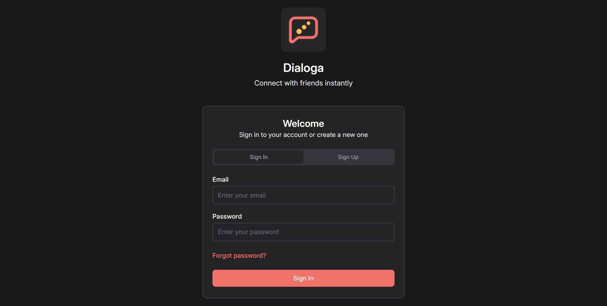
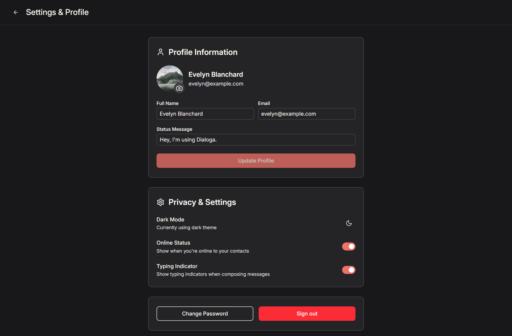

# Project Dialoga

Dialoga is a full-stack practice project built to learn the development of real-time chat applications using the MERN stack (React, Node.js, Express, MongoDB). The core focus was integrating WebSockets for instant communication. This project provided hands-on experience across the entire application lifecycle, from UI design to complex API and database management.

## Features

### Frontend

- **Real-Time Messaging**: Instantaneous message sending and receiving using WebSockets (Socket.IO).
- **User Presence**: Displays the online/offline status of users in real time.
- **"Is Typing" Indicator**: Provides visual feedback when other users are composing a message.
- **Responsive Design**: Fully optimized for seamless viewing and interaction across desktop and mobile devices.
- **Dynamic Scroll & History**: Automatically scrolls to the latest message and loads previous history on demand.

### Backend

- **WebSocket Server**: Dedicated Socket.IO server for handling persistent, bi-directional communication.
- **Secure Authentication**: Implements JWT (JSON Web Tokens) for stateless and secure user access.
- **Scalable Data Model**: Uses MongoDB to efficiently store user data, message history, and conversation metadata.
- **RESTful API**: Provides standard endpoints for user registration, profile updates, and friend management.

## Technologies Used

### Frontend

- **React**: Dynamic, component-based user interface.
- **TypeScript**: Static type checking and improved code quality.
- **Redux Toolkit**: Scalable global state management.
- **React Hook Form**: High-performance form state and validation.
- **Tailwind CSS**: Utility-first CSS for rapid, responsive styling.
- **Zod**: Schema validation for data integrity.

### Backend

- **Node.js**: JavaScript runtime environment for the server.
- **Express.js**: Minimalist framework for API routing and middleware.
- **Socket.IO**: Real-time communication via WebSockets.
- **JWT (JSON Web Tokens)**: Secure, stateless authentication and authorization.
- **MongoDB**: Document-based NoSQL database for persistence.

## Screenshots

  
_Login screen._

  
_Starting a new chat._

  
_Conversation view._

  
_User settings and profile management screen._

## Project Links

- **Frontend Code**: [Frontend Repository](https://github.com/sam4web/project-dialoga/tree/main/frontend)
- **Backend Code**: [Backend Repository](https://github.com/sam4web/project-dialoga/tree/main/backend)
- **Live Application**: [Dialoga Live](https://project-dialoga.netlify.app/)
- **Live API**: [Dialoga API](https://project-dialoga.onrender.com)
